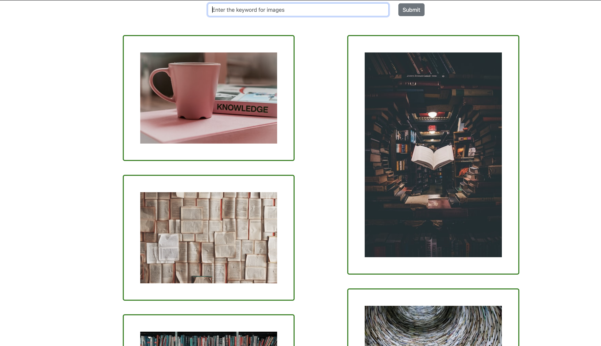
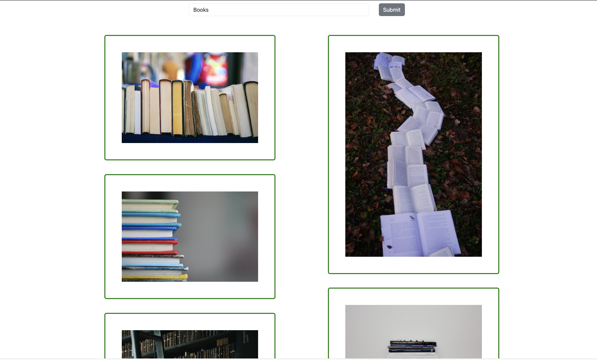

# ImageGen Web App

Generate and display images based on your search term using the ImageGen web application.




## Table of Contents

- [Introduction](#introduction)
- [Features](#features)
- [Installation](#installation)
- [Usage](#usage)

## Introduction

ImageGen Web App is a simple web application built with React and Reactstrap that allows users to generate and view images based on a search term. The app uses an external API to retrieve images and presents them in an attractive layout.

This project was created as a learning exercise to demonstrate the integration of React, Reactstrap, and external APIs in a web application context.

## Features

- Generate and display images based on search terms.
- Responsive and user-friendly interface using Reactstrap components.
- Real-time image updates upon search term changes.

## Installation

To run the ImageGen Web App locally, make sure you have Node.js and npm installed. Then follow these steps:

1. Clone the repository:
   ```bash
   git clone git@github.com:Adarsh-044/imageGenerators.git


2. npm install 
3. npm start
